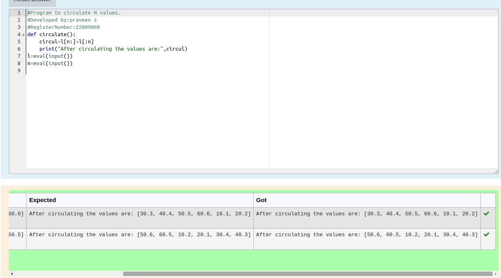

# Circulate-the-values-of-N-variables

## Aim:

To write a python program to circulate the n variables using function concept

## Equipment’s required:

PC
Anaconda - Python 3.7

## Algorithm:

### Step 1: 
Get the n values from the user
### Step 2: 
circulate the values of n variables
### Step 3: 
Get the value from the user for the number of rotation
### Step 4: 
Using the slicing concept rotate the list

### Step 5: 
Print both the values it would be circulated
### Step 6:
End the program
## Program:
```
#Program to circulate N values.
#Developed by:praveen s 
#RegisterNumber:22009060
def circulate():
    circul=l[n:]+l[:n]
    print("After circulating the values are:",circul)
l=eval(input())
n=eval(input())
```
## Output:


## Result:
Thus the Circulate the values of N variables are succesfullu executed